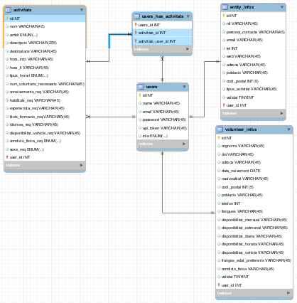

# VOLUNTARIAT TORTOSA

Projecte de pràctiques a l'ajuntament de tortosa.

Aplicació per a la gestió d'activitats de voluntariat de tortosa.

Projecte creat amb Laravel i Vue.

# INDEX

- [ Eines ](#eines)
    - [ Gestors de paquets ](#gestor-de-paquets)
    - [ Frameworks ](#frameworks)
- [ Instal·lació ](#instal·lació)
- [ Fitxers i directoris d'interés ](#fitxers-i-directoris-d'interes)
- [ Models ](#models)
    - [ User ](#user)
        - [ Model ](#model-1)
        - [ Rols ](#rols-1)
        - [ Info ](#info-1)
    - [ Activitat ](#activitat)
        - [ Model ](#model-2)
        - [ Dades ](#dades-1)
    - [ EntityInfo ](#entityinfos)
        - [ Model ](#model-3)
        - [ Dades ](#dades-2)
    - [ VolunteerInfo ](#volunteer-info)
        - [ Model ](#model-4)
        - [ Dades ](#dades-3)
- [ Base de dades ](#base-de-dades)
- [ Rutes ](#rutes)
- [ Components Vue ](#components-vue)

## Eines

Paquets i frameworks necessaris per a correr l'aplicació

### Gestors de paquets

- Composer
- Node.js

### Frameworks

- Laravel (PHP): https://laravel.com/
- Vue (JavaScript): https://vuejs.org/
- Vuetify (JavaScript): https://vuetifyjs.com/ (Estils)

### Altres paquets importants

- Vue-router (js): https://router.vuejs.org/en/
- Vuex (js): https://vuex.vuejs.org/en/

# Instal·lació

(Important tenir composer i node.js abans d'instal·lar el projecte)

Obrir un terminal i accedir a la carpeta on es desarà el projecte i clonar el projecte amb la comanda clone:
        
        $ git clone git@github.com:GreyGonz/voluntariat-tortosa.git

Un cop baixat el projecte executarem les comandes que ens baixaran els paquets i dependencies
necessaris:

        $ cd voluntariat-tortosa
        $ composer install
        $ npm install

Generem un nou enviroment executant:

        $ cp .env.example .env

I generem la key amb:

        $ php artisan key:generate

I per últim executem les migracions:

        $ php artisan migrate:fresh

[ OPCIONAL ] 
En cas de voler omplir la base de dades amb dades de mostra, executarem aquesta altra comanda:

        $ php artisan migrate:fresh --seed

Trobaràs més informació sobre les dades de mostra aqui.

# Fitxers i directoris d'interés

- /App/Providers/AppServiceProvider.php [ més info ](https://laravel.com/docs/5.6/providers)
- /App/Providers/EventServiceProvider.php [ més info ](https://laravel.com/docs/5.0/events)
- /App/Listeners [ més info ](https://laravel.com/docs/5.6/events#defining-listeners)
- /App/Observers [ més info ](https://laravel.com/docs/5.6/eloquent#events)
- /App/Events [ més info ](https://laravel.com/docs/5.6/events)
- /App/Http/Controllers [ més info ](https://laravel.com/docs/5.6/controllers)
- /database/factories [ més info ](https://laravel.com/docs/5.6/seeding#using-model-factories)
- /database [ más info ](https://laravel.com/docs/5.6/migrations)

# Estructura de dades Store (Vuex)

El fitxer principal que carrega aquest paquet es troba a `resources/assets/js/voluntariat/store/index.js`, aquest és 
el que conté totes les variables dins l'[ state ](https://vuex.vuejs.org/en/state.html) i el qual carrega els demes fitxers necessaris. Els quals es troben tots
a dins la mateixa carpeta `resources/assets/js/voluntariat/store/`.

A continuació és fa un petit resum de cadascun: ([ informació més detallada sobre el funcionament d'aquest paquet ](https://vuex.vuejs.org/en/))

- index.js: Carrega tots els fitxers i conté tots els valors que requereix l'aplicació

- actions.js: Conté totes les [ actions ](https://vuex.vuejs.org/en/actions.html) disponibles per a ús de l'aplicació

- action-types.js: Conté tots els noms de totes les [ actions ](https://vuex.vuejs.org/en/actions.html) definides al fitxer "actions.js", actua d'enllaç entre el
fitxer "actions.js" i qualsevol component que vulgui utilitzar alguna "action".

- mutations.js: Conté totes les [ mutations ](https://vuex.vuejs.org/en/mutations.html) disponibles per a ús de l'aplicació

- mutation-types.js: Conté tots els noms de totes les [ mutations ](https://vuex.vuejs.org/en/mutations.html)  definides al fitxer "mutations.js", actua d'enllaç entre
el fitxer "mutations.js" i qualsevol component que vulgui fer ús de qualsevol mutació

- getters.js: Conté tots els [ getters ](https://vuex.vuejs.org/en/getters.html) per a cada una de les variables d'state

# Models

## User

Els usuaris parteixen del mateix model `User.php`, que es troba al directory `/App`. [ Més informació sobre els models Eloquent ](https://laravel.com/docs/5.6/eloquent)

### Model (/app/User.php)

- Atributs: name, email, password, api_token

#### Funcions
 
- activitats: Retorna una [ col·lecció ](https://laravel.com/docs/5.6/collections) de les activitats pertanyents a un usuari amb el rol d'entitat

- registeredActivities: Retorna un [ col·lecció ](https://laravel.com/docs/5.6/collections) de les activitats on es troba registrat un usuari amb el rol de voluntari

- assignEntitat: Assigna un usuari amb un rol voluntari a un usuari amb rol entitat

- info: Retorna un objecte EntityInfo/VolunteerInfo relacionat amb l'usuari depenent del seu rol

### Rols

- SuperAdmin: Controla tota l'aplicació i pot gestionar els administradors, entitats i voluntaris 
- Admin: Controla tota l'aplicació menys la possibilitat de gestionar altres administradors i pot gestionar les entitats i voluntaris 
- Entity: Controla el seu usuari, pot crear i gestionar les seves activitats
- Volunteer: Controla el seu usuari, pot inscriures i desinscriure's de vàries activitat

Un usuari pertany a un únic rol (superAdmin, Admin, Entity o Volunteer) el qual li és assignat 
a través de l'atribut `role` quan es crea el nou usuari.

Exemple de creació d'usuari:

    User::create([
        'name' => 'New User',
        'email' => 'user@email.com',
        'password' => '123456', // preferiblement utilitzar funció bcrypt() per encriptar la contrasenya 
        'role' => 'admin'
    ])

Al crear l'usuari, l'`UserObserver`  llença l'event `UserCreated` que s'encarrega d'assignar el rol
a través de l'atribut `role` amb el que s'ha creat l'usuari.

### Autentificació

Quan l'usuari es dirigeix a la ruta `/login` es carrega el component `resources/assets/js/voluntariat/components/Login.vue`.
Apareix un formulari simple que demana email i contrasenya, un cop insertats, al prèmer el botó `Login`, sexecuta la funció 
que es mostra a continuació.

      login () {
        // Es desen els valors del formulari a la variable credentials
        const credentials = {
          'username': this.email,
          'password': this.password
        }
        // Es crida la funció "LOGIN" del "store" passant-li el valor de credentials, aquesta funció retorna una
        // Promise, d'aquesta manera ens assegurem que tot hagi anat bé abans d'executar la funció "DETERMINATE_ROLE"
        this.$store.dispatch(actions.LOGIN, credentials).then(response => {
          // Es crida la funció "DETERMINATE_ROLE" del "store" passant-li l'objecte $router ja que dins de la funció
          // es necessita fer una redirecció amb el router
          this.$store.dispatch(actions.DETERMINATE_ROLE, this.$router) 
        }).catch(error => {
          console.log(error)
        })
      }

Funció LOGIN del Store:

    [ actionTypes.LOGIN ] (context, credentials) {
      return new Promise((resolve, reject) => {
        // Prova de fer el login amb els valors de credentials
        auth.login(credentials).then(response => {
          // Si tot va bé cambia el valor logged del "store" a true
          context.commit(mutations.LOGGED, true)
          const token = response.data.access_token // Agafa el valor del access_token generat
          // Si existeix el token, el guarda al localStorage per a que no es perdi al fer un 
          // refresh a la pàgina
          if (token) {
            if (window.localStorage) {
              window.localStorage.setItem('token', token)
            }
            context.commit(mutations.TOKEN, token) // Es desa el token a la variable token del "store"
            axios.defaults.headers.common['authorization'] = `Bearer ${token}` // S'aplica el toquen al header per autentificar la conexió
          }
          resolve(response) // Agafa la resposta del login i la llença a la Promise per a poder recollir-la des del component "Login.vue"
        }).catch(error => {
          reject(error) // Agafa l'error del login i el llença a la Promise per a poder recollir l'error des del component Login.vue
        }).then(() => {
          context.dispatch(actionTypes.FETCH_USER) // Guarda l'usuari a la variable user del "store"
        })
      })
    },

Funció DETERMINATE_ROLE del Store:

    [ actionTypes.DETERMINATE_ROLE ] (context, router) {
      // Es crida a la api per agafar el rol de l'usuari logat
      axios.get('api/user/roles').then((response) => {
        const roles = response.data
        // Si la resposta conté el rol, aquest s'emmagatzema al localStorage
        if (roles) {
          if (window.localStorage) {
            window.localStorage.setItem('roles', roles)
          }
          context.commit(mutations.ROLES, roles[0]) // Es desa el rol a la variable roles del "Store"
        }
        // Depenent del rol, redirigeix a la pàgina que pertany a l'usuari
        if (roles.includes('admin') || roles.includes('superAdmin')) {
          router.push('/admin')
        } else if (roles.includes('entity')){
          router.push('/entity')
        } else if (roles.includes('volunteer')) {
          router.push('*')
          // router.push('/volunteer') // TODO
        } else {
          router.push('/login')
        }
      }).catch((error) => {
        console.log(error)
      });
    },

# Activitat

Les activitats parteixen del mateix model `Activitat.php`, que es troba al directory `/App`. [ Més informació sobre els models Eloquent ](https://laravel.com/docs/5.6/eloquent)

### Model

- Atributs: 
    - user_id
    - nom
    - ambit
    - descripcio
    - destinataris
    - hora_inici
    - hora_fi
    - tipus_horari
    - num_voluntaris_necessaris
    - coneixements_req
    - habilitats_req
    - experiencia_req
    - titols_formacio_req
    - idiomes_req
    - disponibilitat_vehicle_req
    - condicio_fisica_req
    - sexe_req
    
#### Funcions

- entitat: Retorna una [ col·lecció ](https://laravel.com/docs/5.6/collections) de totes les entitats propietàries de l'activitat

- volunteers: Retorna una [ col·lecció ](https://laravel.com/docs/5.6/collections) de tots els voluntaris inscrits a l'activitat

## EntityInfo

Les activitats parteixen del mateix model `Activitat.php`, que es troba al directory `/App`. [ Més informació sobre els models Eloquent ](https://laravel.com/docs/5.6/eloquent)

### Model

Atributs:
    - user_id
    - nif
    - persona_contacte
    - email
    - tel
    - web
    - adreca
    - poblacio
    - codi_postal
    - tipus_activitat
    - validat

## VolunteerInfo
### Model
### Dades

# Base de dades

Cal destacar que el següent apartat descriu la DB i el seu funcionament en l'estat
actual de l'aplicació, però és molt probable que la DB hagi de cambiar de forma o
creixer.

A continuació es mostra un petit resum de com funcionaria la base de dades, 
però fa falta llegir les migracions per a entendre correctament el seu funcionament

Com es pot veure la taula principal és usuaris, l'aplicació depenent del rol de l'usuari determina quines
realacions de taules hi haurà a la base de dades.

Quan es crea un usuari amb el rol `admin` o `superAdmin`, unicament es crea un registre
usuari sense cap tipus de relació.
    
En el cas de que es creï un usuari amb el rol `entitat`, l'aplicació s'encarrega de generar una
nova entrada a la taula `entity_infos` relacionada amb l'usuari a través de l'id.
Cada vegada que l'entitat creï una activitat, es genera una nova entrada a la taula 
`activitats` relacionada amb l'usuari també a través del seu id.

En el cas de que es creï un usuari amb el rol `volunteer`, l'aplicació s'encarrega
de generar una nova entrada a la taula `volunteer_infos` relacionada amb l'usuari
a través de l'id. Cada vegada que el voluntari creï s'inscriu a una activitat, es genera una nova
entrada a la taula `activitat_usuaris` que relaciona el voluntari amb l'activitat.

# Rutes

Gestionades per paquet [ vue-router ](https://router.vuejs.org/en/) es troben a `resources/assets/js/voluntariat/router/index.js`
Els components vue són carregats amb [ Lazy loading ](https://router.vuejs.org/en/advanced/lazy-loading.html)

- /: Landing.vue
- (TODO)/register: Register.vue
- /login: Pàgina de login
- /admin: AdminMainLayout.vue
    - /admin: AdminDashboard.vue
    - /activitats: AllActivitiesContainer.vue -> AllActivities.vue
    - /activitats/:id : ActivitatContainer.vue 
    - /entitats: EntitiesContainer.vue -> Entities.vue
    - /entitats/:id : EntityContainer.vue -> Entity.vue 
    - /voluntaris: VolunteersContainer.vue -> Volunteers.vue
    - /voluntaris/:id : VolunteerContainer.vue -> Volunteer.vue 
    - /admins : AdminsContainer.vue -> Admins.vue
    - /admins/:id : AdminContainer.vue -> Admin.vue
- /entity: EntityMainLayout.vue
    - /entity: EntityDashboard.vue (TODO)
    - /activitats_user: ActivitatsContainer.vue -> Activitats.vue
    - /activitats_user/:id : ActivitatContainer.vue -> Activitat.vue
    - /crear_activitat: CreateActivity.vue
- '*' : NotFoundComponent.vue
 
## Components Vue (Pàgines)
 
### Landing.vue (TODO)
Pàgina web principal de presentació.

Pàgina senzilla de presentació, on es mostrarán totes les activitats actualitzades, botó de registre i login

### Register.vue (TODO)

Formulari per a registrar-se com a voluntari i poder accedir a l'aplicació

### Login.vue 

Pàgina de login senzilla amb formulari d'accés (email i contrasenya) (Possibilitat de social login amb google)

### AdminMainLayout.vue

Layout de la part administrativa de l'aplicació

### AdminDashboard.vue (TODO)

Pàgina principal de la part d'administració, amb un resum d'activitats, entitats i voluntaris, amb
possibilitat d'accedir individualment a cada objecte, obtenir més informació o crear-ne de nous.

### AllActivitiesContainer.vue

Container del component `AllActivities.vue`, s'encarrega de provisionar de la informació que necessita el component `AllActivities.vue` i executa les funcions cridades des del mateix.

### AllActivities.vue

Mostra una taula amb totes les activitats de l'aplicació, permetent eliminar i accedir a cadascuna d'elles individualment

### ActivitatContainer.vue

Container del component `Activitat.vue`, s'encarrega de provisionar de la informació que necessita el component `Activitat.vue` i executa les funcions cridades des del mateix.

### Activitat.vue

Mostra informació detallada d'una activitat identificada per el seu id i permet afegir, modificar i eliminar els diferents voluntaris inscrits a l'activitat i les entitats que organitzen la mateixa.

### EntitiesContainer.vue

Container del component `Entities.vue`, s'encarrega de provisionar de la informació que necessita el component `Entities.vue` i executa les funcions cridades des del mateix.

### Entities.vue

Mostra una taula amb totes les entitats registrades a l'aplicació, permetent eliminar i accedir a cadascuna d'elles individualment

### EntityContainer.vue

Container del component `Entities.vue`, s'encarrega de provisionar de la informació que necessita el component `Entities.vue` i executa les funcions cridades des del mateix.

###  Entity.vue

Mostra informació detallada d'una entitat identificada per el seu id i permet afegir, modificar i eliminar les seves activitats.

### VolunteersContainer.vue

Container del component `Volunteers.vue`, s'encarrega de provisionar de l'informació que necessita el component `Volunteers.vue` i executa les funcions cridades des del mateix.

### Volunteers.vue

Mostra una taula amb tots els voluntaris registrats a l'aplicació, permetent eliminar i accedir a cadascun d'ells individualment.

### VolunteerContainer.vue

Container del component `Volunteer.vue`, s'encarrega de provisionar de la informació que necessita el component `Volunteer.vue` i executa les funcions cridades des del mateix.

### Volunteer.vue

Mostra informació detallada d'un voluntari identificat per el seu id i permet afegir, modificar i eliminar les activitats a les que està inscrit.

### AdminsContainer.vue

Container del component `Admins.vue`, s'encarrega de provisionar de la informació que necessita el component `Admins.vue` i executa les funcions cridades des del mateix.

### Admins.vue

Mostra una taula amb tots els admins registrats a l'aplicació, permetent eliminar i accedir a cadascun d'ells individualment.

### AdminContainer.vue

Container del component `Admin.vue`, s'encarrega de provisionar de la informació que necessita el component `Admin.vue` i executa les funcions cridades des del mateix.

### Admin.vue

Mostra informació detallada d'un admin identificat per el id.

### EntityMainLayout.vue

Layout de l'aplicació per a les entitats

### EntityDashboard.vue (TODO)

Pàgina princiapal de l'aplicació per a entitats, amb un resum de les últimes activitats a les que s'ha inscrit algun usuari,
amb possibilitat de acceptar/denegar voluntaris que han demanat solicitud, veure i eliminar activitats,

### ActivitatsContainer.vue

Container del component `Activitats.vue`, s'encarrega de provisionar de la informació que necessita el component `Activitats.vue` i executa les funcions cridades des del mateix.

### Activitats.vue

Mostra una taula amb totes les activitats relacionades amb l'usuari. Per a una entitat, aquest component mostrarà totes les activitats en propietat,
per a un usuari, mostrarà totes les activitats a les que es troba inscrit.
La taula permetrà eliminar les seves activitats a una entitat, mentres que a un usuari només es permet desinscriures de l'activitat.
Clicant damunt d'una activitat de la taula, es mostrarà més informació detallada de l'activitat.

### CreateActivity.vue

Formulari que es mostrarà per crear una nova activitat

### Inbox.vue (TODO)

Notificacions d'usuari

# Base de dades
## Notes

- Les activitats preferents de cada voluntari vindràn de la relació entre la taula "voluntaris" i la taula "tipus_activitats"

- Menú Admins (Login requerit):
    - Inbox
    - Dashboard
    - Activitats
    - Entitats
    - Voluntaris
    - Admins
    - Configuració del compte

- Menú Entitats (Login requerit):
    - Inbox
    - Les meves activitats
    - Els meus voluntaris
    - Configuració del compte

- Menú Voluntaris (Login requerit):
    - Inbox
    - Activitats (a les que el voluntari es troba inscrit)
    - Configuració del compte

- Menú General:
    - Home
    - Activitats
    - Entitats
    - Preguntes Freqüents
